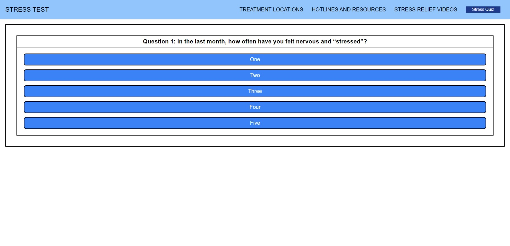

# This is a Stress Questionnaire for the first group project of the UofU Coding Bootcamp.

## The goal of this assignment was to create a unique webpage from scratch that called at least 2 server-side APIs, while coordinating with the group. This was completed using HTML, JavaScript, jQuery, Tailwind CSS, the Google Maps API, and the Youtube API.

>**Our Group Consisted of:**
>
>Joel Higuera  
>Sage Kirby  
>Holden Atkinson  
>Jayden Griffith  

Screenshot: 

>**Open Code Files:**
>
>[HTML](./index.html)
>
>[CSS](./Assets/css/style.css)
>
>[Script](./Assets/js/script.js)

Live Site: https://joelhiguera.github.io/Stress-Project-/
